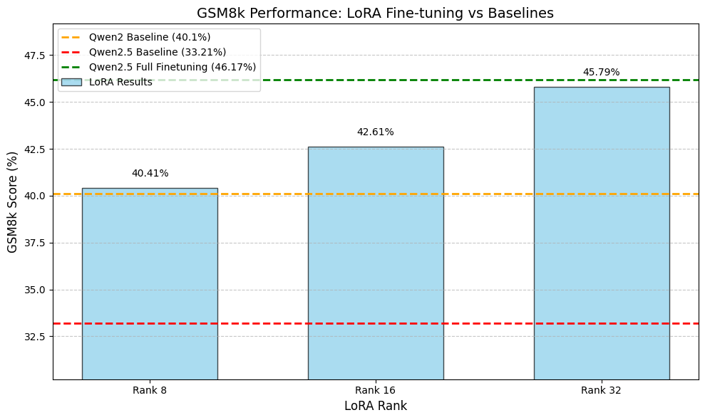

# Qwen 2.5 0.5B PEFT Finetuning for long reasoning  
Finetuning (both full finetuning and PEFT (LoRA) finetuning) a small model (Qwen2.5-0.5B-Instruct) with GSM8K for long reasoning capabilities. 

Original notebook (only full-finetuning code) by Will Brown ([X profile](https://x.com/willccbb)). 
PEFT finetuning code and (model) evaluation code by me.

(I could not find the release post of the original notebook)

# progress
We plan to perform full finetuning (as a baseline) and PEFT finetuning using LoRA adapters of Rank 8, 16 and 32 

-Full finetuning :white_check_mark:
- Rank 8 LoRA adapter :white_check_mark: 
- Rank 16 LoRA adapter :white_check_mark: 
- Rank 32 LoRA adapter :white_check_mark: 

# Full Evaluation

